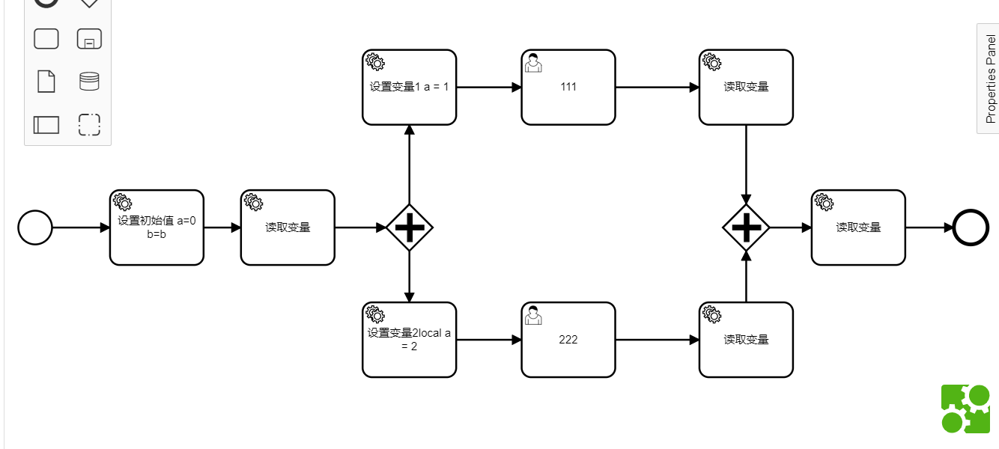
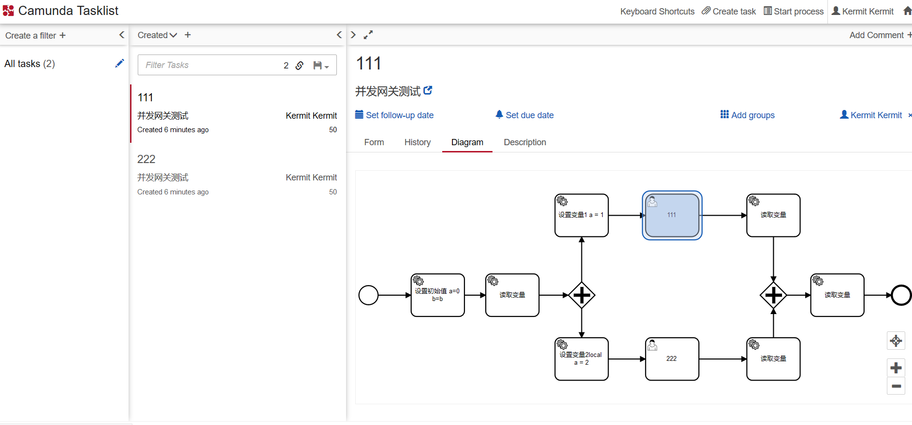
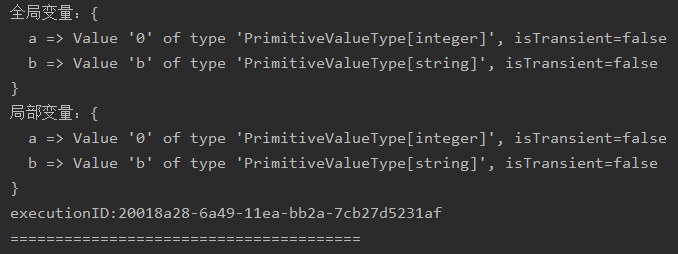
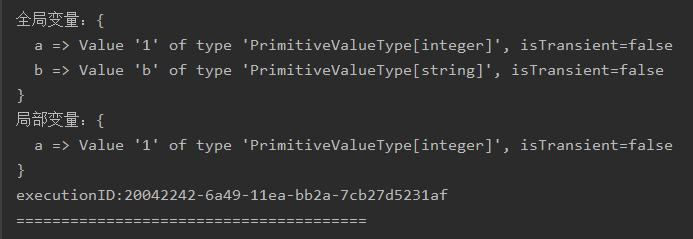
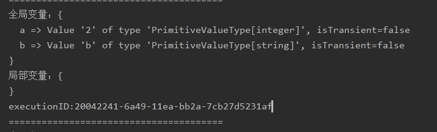
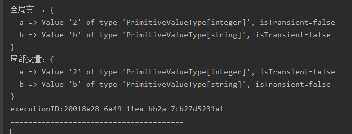

## 只有并发网关的情况
首先解读这张图中各个读取变量组件的情况


设置初始值里的方法：
```java
        delegateExecution.setVariableLocal("b","b");
        delegateExecution.setVariable("a",0);
```
设置变量1里的方法：
```java
        delegateExecution.setVariableLocal("a",1);
```
设置变量2里的方法：
```java
        delegateExecution.setVariable("a",2);
```
读取组件里的方法：
```java
        Map<String, Object> variables = delegateExecution.getVariables();
        Map<String, Object> variablesLocal = delegateExecution.getVariablesLocal();
        System.out.println("全局变量：" + variables);
        System.out.println("局部变量：" + variablesLocal);
        System.out.println("executionID:" + delegateExecution.getId());
        System.out.println("=======================================");
```

在开始执行之后，我们显然会被分配到2个用户任务111和222



并且执行了rootExecution的读取变量方法，此时我们的控制台里打印了



当我们完成了用户任务111之后打印的信息



可以发现此时executionID发生了改变，即进入并发网关后产生了新的execution，且此时通过getVariablesLocal()方法只获取到了当前execution的a变量的值，而getVariables()除了a还获取到了根execution的b变量的值

由此我们可以知道：对于一棵execution树，将每个execution都比作一个叶子节点，每个execution都相当于有一个存储变量的map，getVariablesLocal()只获取当前节点的变量，而getVariables()可以获取到当前节点以及所有父节点的变量，且当子节点的变量与父节点有相同名称的时候，会使用子节点的变量值

当我们完成了用户任务222之后打印的信息



此时局部变量没有任何值，印证了我们上一步的结论，并且得出另一个信息，setVariableLocal是在当前execution中设置变量，而setVariable是在根execution中设置变量

此时executionID也是新的

最终当两个任务均完成后，并发网关触发，执行最后的读取变量



注意到此时executionID与第一个根executionID相等，因此证明了当叶子节点上的任务均完成时，execution将会变回根节点的execution

## 总结：
#### 对于存取变量：共有4个方法setVariable，setVariableLocal，getVariable，getVariableLocal
#### 对于set方法，如果你希望你设置的变量在当前execution之外也可以使用，请使用setVariable方法，否则使用setVariableLocal方法
#### 对于get方法，无特殊情况，一律使用getVariable方法，因为getVariable取出来的数据是大于等于getVariableLocal方法的

[英文详细文档地址](https://docs.camunda.org/manual/7.12/user-guide/process-engine/variables/)


