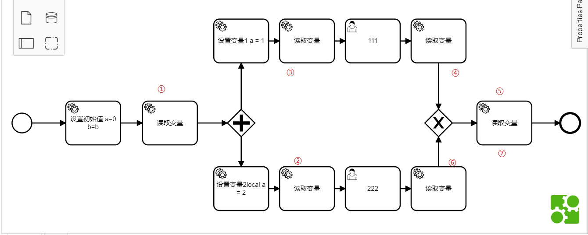
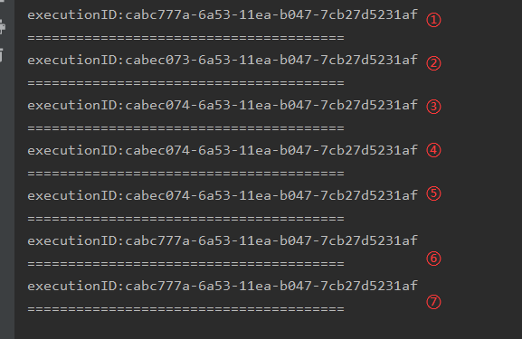

## 并发网关后接排他网关的情况
该图与只有并发网关的情况的唯一区别是后面的一个并发网关被换成了排他网关

执行过程与只有并发网关的情况相同，为了省略执行过程，每个读取变量只打印当前的executionID

根据之前的操作，不难分析出这张图的执行顺序是

①-->②③同时执行-->④-->⑤-->⑥--⑦

⑤和⑦代表同一个事件，因为，④和⑥执行完成后进入排他网关均会执行最后一个读取变量service

分析这个过程，在①执行完成后进入了并发网关，②和③为引擎开的2个新的execution，在完成了usertask111之后，④和⑤的executionID确实是和usertask111执行完之前的③是一样的。

而对于usertask222来说，在usertask111执行完之后执行usertask222，此时在执行完usertask222之后，此时的executionID不再是执行usertask222之前读取出的ID，而是根executionID

所以可以看出Camunda引擎有这样一个机制：如果在execution树中只剩下一个根节点和一个叶子节点（其他一个节点因为走到了出口事件不存在了），那么此时他会将这个叶子节点合并到树节点上以优化性能

这样会有什么问题？如果我使用runtimeService去做设置变量的时候，由于是系统外部，所以需要传入一个executionID，当我在②这个步骤将executionID传出去的时候，我无法知道在什么情况下这个execution会不再存在，即发生上面的情况。这种情况下，当我向一个不存在的execution中设置变量，系统会抛出executionID不存在的异常。

## 总结
#### 因此，当通过runtimeService对execution进行操作的时候，应当先查询executionID是否存在，如果不存在，则查询其父executionID是否存在，直到查到根节点

