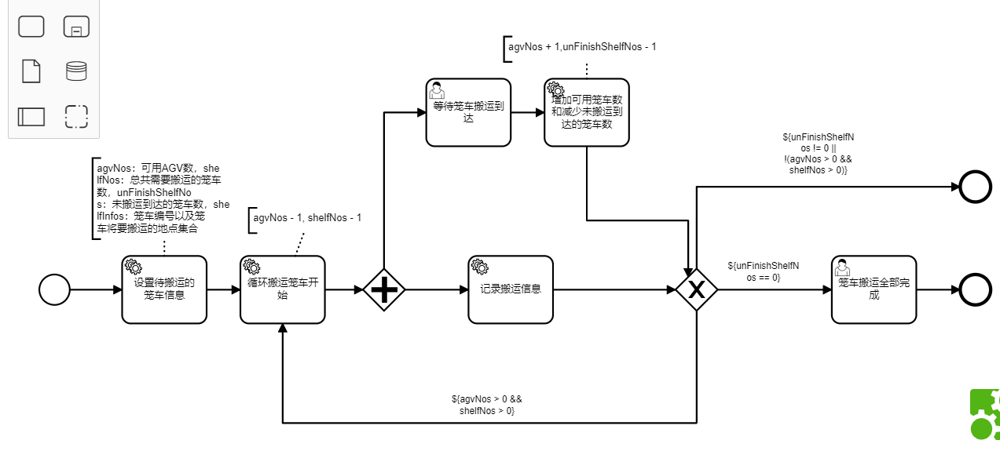
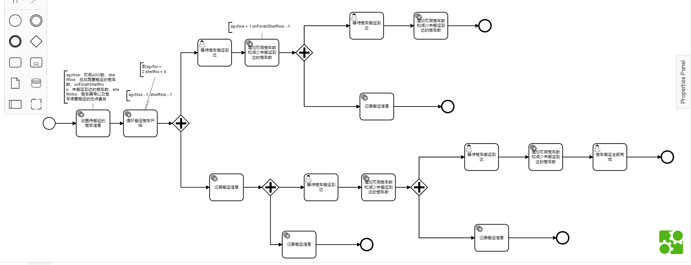

## 并发网关与排他网关组成循环的情况（以预出库为例）

该图为预出库模型的bpmn文件



该图为了使循环成立共设置了4个参数：agvNos：可用AGV数，shelfNos：总共需要搬运的笼车数，unFinishShelfNos：未搬运到达的笼车数，shelfInfos：笼车编号以及笼车将要搬运的地点集合

我们假设agvNos = 2，shelfNos = 4， unFinishShelfNos = 4为初值来分析这张图。

每当经过循环搬运笼车开始组件，会向极智嘉的RMS系统发送一次搬运笼车请求，请求的笼车编号和要到达的位置为shelfInfos中的第一条数据。

当收到RMS成功收到我们的请求的响应时，我们会将agvNos - 1，shelfNos - 1，并且移除shelfInfos的第一条数据
<details>
<summary>该组件代码</summary>
<pre><code>
public class StartLoopMoveShelf implements JavaDelegate {
	@Override
	public void execute(DelegateExecution execution) throws Exception {
	    //取值
		Integer agvNos = (Integer) execution.getVariable("agvNos");
		Integer shelfNos = (Integer) execution.getVariable("shelfNos");
		List<Pair<String, Dest>> shelfInfos = (List<Pair<String, Dest>>) execution.getVariable("shelfInfos");
		Pair<String, Dest> shelfInfo = shelfInfos.get(0);
		String shelfCode = shelfInfo.getKey();
		Dest dest = shelfInfo.getValue();
		//发送请求
		IDeviceManager deviceManager = IotResourceManager.getInstance().getDeviceManager("CDRMS");
		AgvDeviceGroup agvDevice = (AgvDeviceGroup) deviceManager.getDeviceGroup();
		MoveShelfCommand responseCommend = agvDevice.moveShelf(shelfCode, dest);
		//处理响应
		if (responseCommend.getIsProcessed() && responseCommend.getProcessCode().equals("00")) {
			execution.setVariable("command", responseCommend);
			execution.setVariable("agvNos", agvNos - 1);
			execution.setVariable("shelfNos", shelfNos - 1);
			shelfInfos.remove(0);
			System.out.println("agvNo is :" + agvNos + " shelfNos is : " + shelfNos + "shelfInfos is :" + shelfInfo);
		} else {
			throw new Exception("命令发送失败！");
		}
	}
}
</code></pre>
</details>

这一步之后会进入并发网关，同时激活记录笼车搬运信息和等待笼车到达。

等待笼车到达是一个UserTask，我们在这个UserTask上挂了一个Listener（监听器），同时创建了一个规则引擎，用于处理Agv任务完成发回的回调信息。

记录笼车搬运信息不会产生阻塞，因此直接触发之后的排他网关，此时agvNos = 1，shelfNos = 3，因此根据排他网关后的条件，应该返回循环搬运笼车开始组件开始循环。

重复一遍上面的操作，即又发了第二个搬运指令，触发了第二个UserTask，再第二次到达记录笼车搬运信息之后的排他网关，此时agvNos = 0，shelfNos = 2，根据条件，我们现在没有可以用来搬运的笼车，因此走到了出口。

当一个Agv完成了他的搬运任务触发了UserTask，此时触发了规则引擎，规则引擎在外部通过executionID完成了设置变量的操作，通过runtimeID完成了UserTask的complete操作。

此时经过“增加可用笼车数和减少未搬运到达的笼车数”组件后 agvNos = 1 ，unFinishShelfNos = 3 ， shelfNos = 2符合循环条件再次进入循环调用笼车搬运。

每当有一个agv任务完成均会触发此循环，直到最后unFinishShelfNos = 0，标志预出库完成。

当agvNos = 2，shelfNos = 4， unFinishShelfNos = 4，该图可以展开为



由于存在多个出口的情况，因此最后一个完成的笼车会遇到[Execution原理实例分析--并发网关与排他网关](Execution原理实例分析--并发网关与排他网关.md)中出现的情况。通过[Execution原理实例分析--并发网关与排他网关](Execution原理实例分析--并发网关与排他网关.md)最后的总结的方法可以解决该问题

示例代码如下
```java
private void setExecutionVariables(IEvent event, String executionID, String rootExecutionID){
		RuntimeService runtimeService = IotBeanUtil.getBpmnRuntimeServiceBean();
		// camunda 引擎，在循环执行流程的最后一次循环时，会用 rootExecution 来执行，此时子 Execution 已被清除，这种情况只能向 rootExecution 上来设置变量
		List<Execution> list = runtimeService.createExecutionQuery().list();
		boolean isExisted = false;
		for (Execution execution : list) {
			if (execution.getId().equals(executionID)) {
				isExisted = true;
			}
		}
		if (isExisted) {
			try {
				runtimeService.setVariableLocal(executionID, "event", event);
			} catch (NullValueException e) {
				runtimeService.setVariableLocal(rootExecutionID, "event", event);
			}
		} else {
			runtimeService.setVariableLocal(rootExecutionID, "event", event);
		}
	}
```

