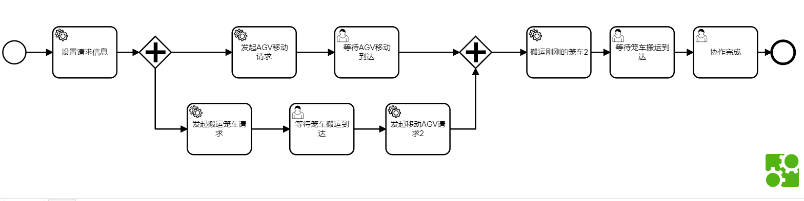
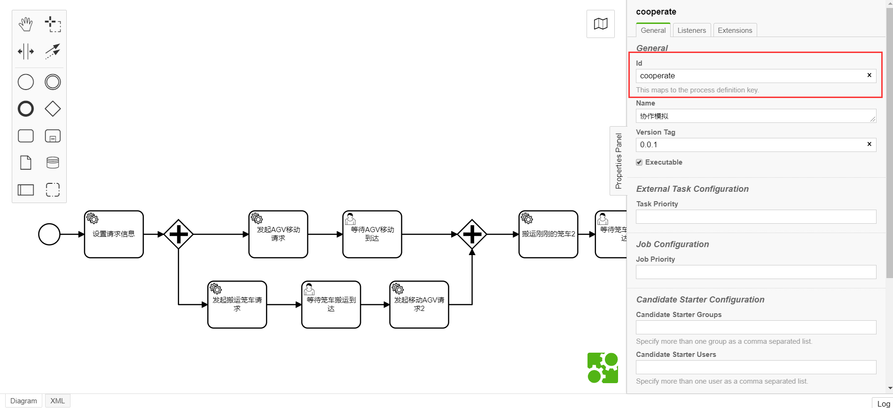
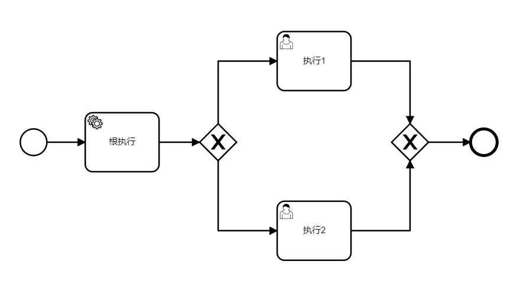
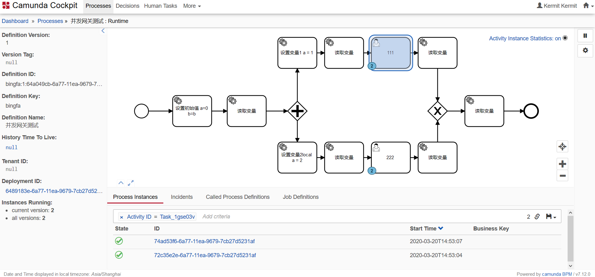

## CAMUNDA引擎基础概念

#### Process Definitions（流程定义）

流程定义代表了一个流程的结构，下图即是一个Camunda的流程定义，Camunda BPM使用BPMN 2.0 规范作为其定义流程的语言



***
>- 流程定义查询
>
>通过JavaApi的RepositoryService可以查询所有的流程定义
>
>```java
>  List<ProcessDefinition> processDefinitions = repositoryService.createProcessDefinitionQuery()
>      .processDefinitionKey("invoice")
>      .orderByProcessDefinitionVersion()
>      .asc()
>      .list();
>```
>这条查询按版本顺序返回所有的key为invoice的流程定义
***
>- 流程定义的key和其版本
>
>流程的key（如上例所示的invoice）是一个流程定义的逻辑标识符，即一个key对应了唯一一个流程定义  
>
>
>
>**当复制一份流程定义的时候，必须更改此值，否则在部署时会报错**
***
  
#### Process Instances（流程实例）

流程实例与流程定义的关系可以类比于Java中的Object和和Class，一个流程定义可以创建多个流程实例，就像一个Class可以创建多个Object。

流程引擎负责创建流程实例并管理他们的状态，如果流程中含有需要等待的情况（如UserTask），流程引擎在运行时会将这些状态存入数据库（ACT_RU开头的表），并在等待状态结束后（UserTask被complete后）释放

***
> - 开启一个流程实例
>
>通过RuntimeService的startProcessInstanceByKey方法
>
>```java
> ProcessInstance instance = runtimeService.startProcessInstanceByKey("invoice");
>```
>通过以下方法可以在开启流程实例的时候设置变量
>```java
>Map<String, Object> variables = new HashMap<String,Object>();
>variables.put("creditor", "Nice Pizza Inc.");
>ProcessInstance instance = runtimeService.startProcessInstanceByKey("invoice", variables);
>```
>
***
> - 查询流程实例
>
>通过RuntimeService的createProcessInstanceQuery方法
>
>查所有的
>```java
>runtimeService.createProcessInstanceQuery().list()
>```
>带条件
>```java
>runtimeService.createProcessInstanceQuery()
>     .processDefinitionKey("invoice")
>     .variableValueEquals("creditor", "Nice Pizza Inc.")
>     .list();
>```
***
> - 暂停流程实例
>
>如果不想让流程实例继续执行，可以暂停流程实例，也可以恢复运行
>
>比如当流程中的变量值错了，此时可以暂停流程实例并为其重新赋值
>
>当流程暂停时，所有涉及会使流程继续进行的操作将不可用，如 complete task， task delegation，但是可以设置和移除流程上的变量
>
>通过以下代码暂停一个流程实例
>```java
>runtimeService.suspendProcessInstanceById(processInstanceId)
>```
>通过以下代码恢复一个流程实例
>```java
>runtimeService.activateProcessInstanceById(processInstanceId)
>```
***
#### Executions （执行）

如果一个流程实例含有多条并发执行的路径，如并发网关，流程引擎就需要去区分目前流程实例所运行的路径。如下图所示，在执行完根执行后，执行1和执行2均被触发，进入等待完成的状态，此时在两个分支上产生了不同的execution。



以下情况会产生新的execution
1. parallel gateway（并行网关）或者没有并行网关但是等同于并行网关的情况，比如上图将第一个并行网关去掉，流程没有任何改变
2. Embedded Sub Process（内嵌子流程）
3. Multi Instance（多实例模型）

execution的创建如同树状结构一样，而processInstance则是这棵树的根节点，processInstance自身也是一个execution。

execution的变量是有范围性的，execution中设置和取出变量分别有两种方法

***
> - 查询execution
>
>通过以下代码查询所有execution
>```java
>runtimeService.createExecutionQuery().list();
>```
***
> - 查询executionId
>
>通过以下代码查询当前service的executionId
>```java
>public class Test implements JavaDelegate {
> 	@Override
> 	public void execute(DelegateExecution execution) throws Exception {
> 	    execution.getId();
> 	}
> }
>```
***
> - execution原理详细解析  
> [Execution原理实例分析--变量篇](Execution原理实例分析--变量篇.md)  
> [Execution原理实例分析--并发网关与排他网关](Execution原理实例分析--并发网关与排他网关.md)  
> [Execution原理实例分析--预出库](Execution原理实例分析--预出库.md)
***
#### Activity Instances（活动实例）

活动实例指的是每个Execution中正在执行的各个节点，如下图的控制台界面所示，当我启动2此“并发网关测试”流程实例的时候，此处111UserTask上的数字2就表示当前此节点的活动实例个数



活动实例依附于execution，同样具有树形结构的特征。