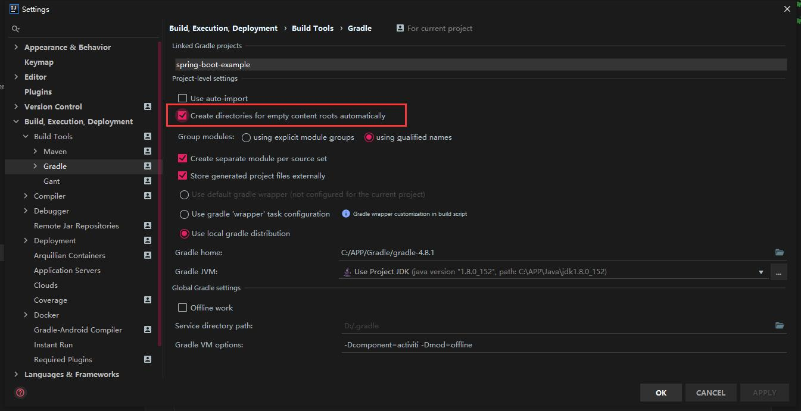
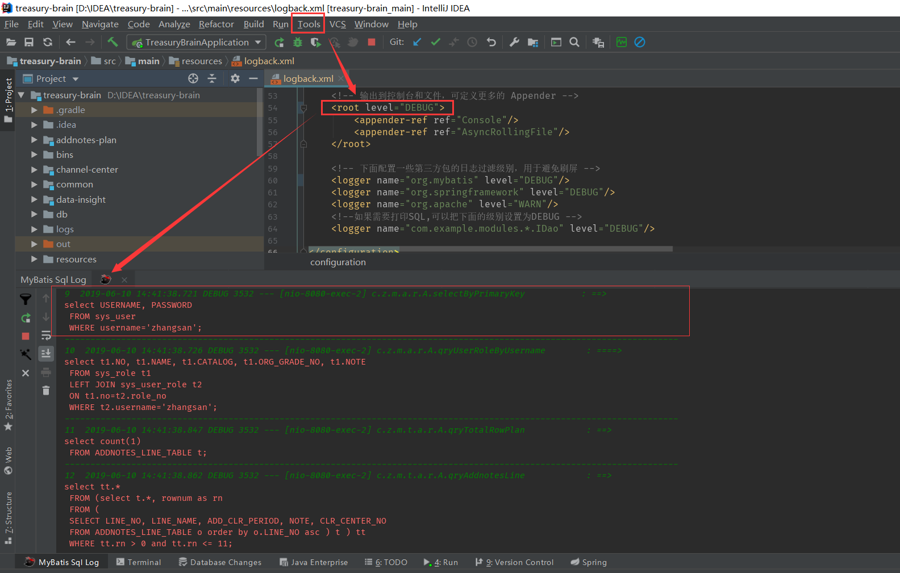
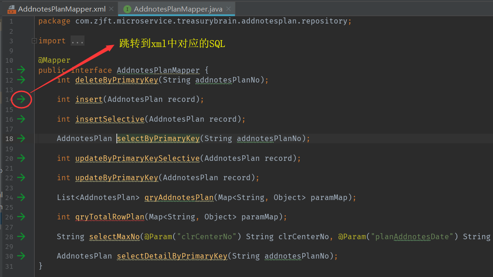
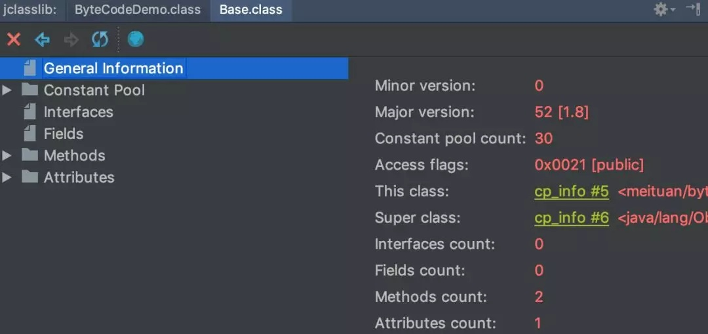

## 开发者指南


### 1.项目模块开发

#### 1.1.创建一个聚合项目

参见：[新建微服务项目向导](新建微服务项目向导.md)

#### 1.2.项目子模块的划分

每个子模块代表一个业务分组，比如 “加钞计划” 子模块。

每个子模块又分为多个部分：

- **api子模块** 
    
    - web包： **web层**，Controller 接口（restful api）
    - dto包： **DTO**，数据传输对象（restful 接口中传输的对象型数据）
    
- **impl子模块**  
    - `po` ： **数据库持久化对象**，所有字段与数据库表一一对应
    - `domain`  ： **领域对象**，经过业务sql查询组合后的对象
    - `mapstruct` ： **POJO**相互转换的工具类
    - `repository` ： **DAO层**，MyBatis接口
    - `service` ： **业务逻辑层**，service 接口以及实现类
    - `web` ：**web层**，Controller 的实现类

详情参见：[项目目录结构](../specifications/项目结构规约.md)

依赖管理请参考：[项目依赖关系与管理方法](../concepts-and-designs/项目依赖关系与管理方法.md)

#### 1.3.新增一个子模块

1. 打开项目根目录的 settings.gradle，增加
    ```groovy
        include 'user-center:user-center-api'
        include 'user-center:user-center-impl'
    ```
        
    > PS:本节以`user-center`用户中心模块作为示例
    
2. 如下图，勾选 gradle 配置，然后刷新依赖，生成对应子模块目录
    
    
3. 进入 **user-center** 目录，创建 build.gradle 文件，如下添加依赖：
    ```groovy
        project("user-center-api") {
           dependencies {
               // 此处添加子模块自己的依赖
           }
        }
    
        project("user-center-impl") {
           dependencies {
               // 此处添加子模块自己的依赖
               // 下面这行表示 `user-center-impl模块` 依赖了 `user-center-api模块`
               compile project(":user-center:user-center-api")
           }
        }
    ```
4. 打开 **项目根目录的 build.gradle 文件**，在最后根项目的 `dependencies{}` 中 `if (!"cloud".equals(buildMod)) {}` 下，加入 `compile project(":model-name:model-name-impl")`，效果如下：
    ```groovy
       dependencies {         
           compile project(":user-center:user-center-impl")
       }
    ```


### 2.`重要`：编码规范

#### 2.1.`重要`：后端接口开发

- 后端项目以 RESTful 风格提供 http 接口（即 controller 层接口），

-  在项目开发初期，我们应当先与前端约定接口，具体实现可以稍后进行开发。

- 本项目采用 `swagger` 框架的注解形式，在 controller 接口层直接标注接口信息。可以自动生成在线的接口文档。


**接口文档开发规范：** [接口文档开发规范](../specifications/接口文档开发规范.md)

**配置接口权限请参考：** [接口与菜单权限的开发配置规范.md](../specifications/接口与菜单权限的开发配置规范.md)

**特别注意：Controller 接口必须符合以下规范 **

`下文中 controller 对应到具体的类名称，都以 Resource 结尾，即将接口看做后端的一种资源`

1. 必须声明一个 `Resource java interface`，如 `UserResource.java`
2. 在 Resource 中的接口方法上使用 `PostMapping`,`GetMapping` 等注解定义 RESTful 接口的资源
    
    ```java
    /**
     * @author xxxx
     * @since 2019-03-08
     */
    @Api(value = "用户中心：用户管理", tags = {"用户中心：用户管理"})
    public interface UserResource{
    
        // ${user-center:}  引用 `application.yml` 中的模块前缀
        // v2      版本号
        // user    子模块名称
        Stirng PREFIX = "${user-center:}/v2/user";
       
        @RequestMapping(PREFIX + "/xxx")
        DTO updateUserByUsername(UserDTO userDTO);
    }
    ```
    
3. 如果接口中使用了对象封装数据，应当声明为 `DTO 对象`，实现 Serializable 接口，以 DTO 结尾，如 `UserDTO.java`
4. Resource 接口的实现类，以 **Impl** 结尾，并声明注解 `@RestController`，如 `UserResourceImpl.java`

> 分离接口声明与实现，好处是项目初期，只进行接口声明，相当于先写接口文档

> **注意在 Resource 接口中不要写 @RestController，** <br/>
> **而在 ResourceImpl 中不应当再出现 @RequestMapping @GetMapping 等注解**

#### 2.2.项目模型命名规约

项目使用的模型对象包含：

- [x] PO（Persistent  Object）：持久化对象，与数据库表结构严格一一对应，通过 DAO 层向Service层传输
- [x] DO（Domain  Object）：实体领域对象，与数据库表结构对应，可以在PO的基础上拓展其他字段，通过 DAO 层向Service层传输
- [x] DTO（Data Transfer Object）：数据传输对象，Service 或 Controller 向外传输的对象
- [x] `POJO（Plain Ordinary Java Object）：POJO专指只有setter/getter/toString的简单类，包括PO/DO/DTO等`

模型对象依据其类别放入对应的包下，详情参见：[项目目录结构](../specifications/项目结构规约.md)


命名规约：

- 持久化对象：xxxPO，xxx为数据库表名，字段与数据库表严格对应（SysOrgPO -> SYS_ORG）
- 领域对象：xxxDO，xxx为数据库表名，字段基于数据库表进行扩展（SysOrgDO -> SYS_ORG）
- 数据传输对象：xxxDTO，xxx为业务领域相关的名称，用于屏蔽和组合业务字段与前端交互
- POJO是PO/DO/DTO的统称，禁止命名成xxxPOJO


#### 2.3.注释

- 不要使用行尾注释

- 方法外部和变量使用文档注释，`/**  **/`

- 方法内部使用 普通注释   `//`   `/* */`

- service业务逻辑层，强制要求添加方法级别的文档注释

- 注释要能够准确反应业务设计思想和代码逻辑

- 注释是给自己看的，无论间隔多长时间，也能清晰理解当时的思路 ； 注释也是给继任者看的，使其能够快速接替自己的工作。


#### 2.4.生成在线接口文档并测试

1. 开发完成的接口需要自测
2. 启动 springboot 应用
3. 查看在线接口文档，访问：[http://localhost:8080/swagger-ui.html](http://localhost:8080/swagger-ui.html) 
4. 账号密码：zhangsan/123456


### 4.插件和工具
#### 4.1.Lombok plugin

使用 lombok 可以简化 POJO 对象的代码，lombok 在程序编译过程中介入，代替我们生成所需要的 getter 和 setter，以及构造函数

通过在 POJO 对象上添加相应的注解来使用 lombok，详见：
 
 [IDEA 配置 Lombok 插件](http://ubuntu/zj-public/gitlab-user-doc/blob/master/Idea/Lombok-Plugin.md)
 
 [Lombok 注解使用说明](../tools/lombok.md)

#### 4.2.Mapstruct Tool

使用 mapstruct 可以将某几种类型的对象映射为另外一种类型，如将多个 DO 对象转换为 DTO 对象

使用方式也很简单，定义一个映射接口，声明映射方法，配上注解，MapSturct 就会实现此接口，详见 [Mapstruct 使用说明](../tools/mapstruct.md)

#### 4.3.Alibaba Java Coding Guidelines plugin
代码格式规范插件

#### 4.4.MyBatis Log Plugin
打印执行的完整SQL。（可选）



#### 4.5.Free Mybatis plugin
xml和mapper接口间快速跳转。（可选）



#### 4.6.jclasslib
javap命令工具，可以直观地看到当前字节码文件的类信息、常量池、方法区等信息

选择Java文件或者字节码文件，View -> Show ByteCode...
