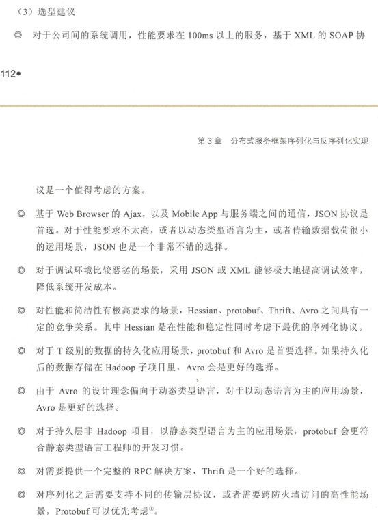

## 框架文档集合

### Redis

redis 安装文档: [Redis.md](./Redis.md)

### Docker

docker 安装文档: [Docker.md](./docker.md)

### Jmeter

压测： [Jmeter.md](./Jmeter.md)

### Jenkins

Jenkins 启动文档: [Jenkins.md](./Jenkins.md)

### RocketMQ

V4.4 安装部署文档: [RocketMQ.md](./RocketMQ.md)

### Nacos

1.1 文档 [Nacos.md](./Nacos.md)

### SkyWalking

6.2 文档 [SkyWalking.md](./SkyWalking.md)

### seata

TODO  0.7 预研
      1.0 可用
      
### 字节码框架选型

JSR-269 注解处理器 和 [Class.md](./Class.md)
      
### 序列化框架选型

