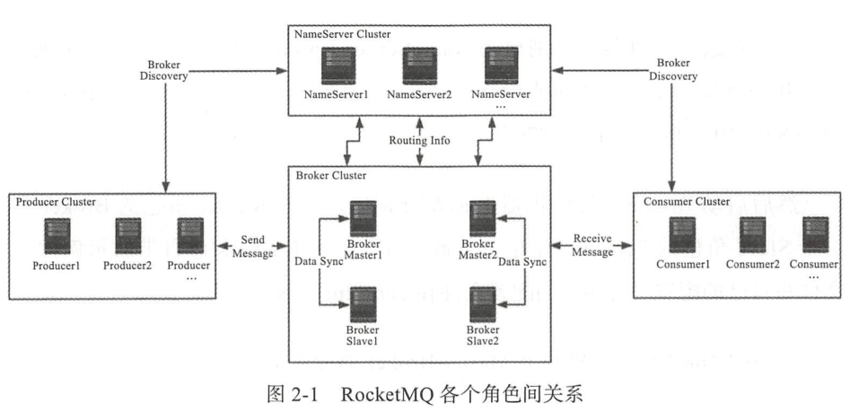
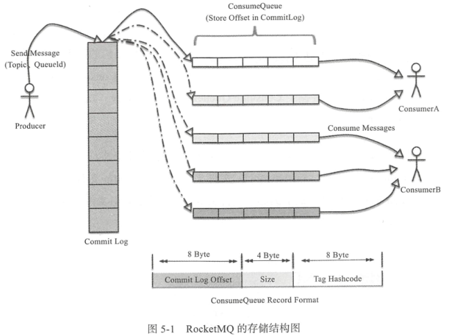
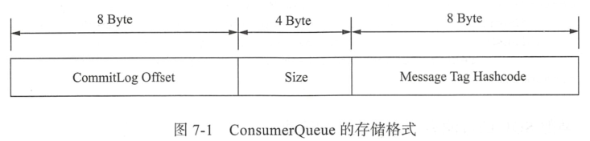

# MQ选型对比


| 中间件     | 开发语言  | 客户端 | 协议 | 并发 | 延迟 |使用场景|
| --------- | ------- |----  |---- |---  |---  |--- |
| ActiveMQ  |  Java   | 较多   | JMS1.1  |  万级   |   毫秒   | 小项目，简单场景
| RabbitMQ  |  Erlang |  较多  |  AMQP   |  小于十万级   |   微秒   | 低延迟
| RocketMQ  |  Java   |  较少   |  -  |  十万级   |   毫秒   | 高并发、高可用
| Kafka     |  Scala  |   较多   |  -  |  大于十万级   |   毫秒  | 大数据场景
| ZeroMQ    |   C++   |   非常多   |   去中心化<br/>通讯协议库  |  百万级   |   微秒  |当需要海量吞吐以及无单点故障风险的消息队列支撑你的复杂工作流，<br/>需要对陡峭的学习曲线做好准备。


#### 介绍
NameServer 注册和管理
Broker 数据存储，（Master/Slave）
Topic 消息主题
Message Queue 相当于Topic的分区
Producer 生产者
Consumer 消费者





#### 开发

#### 消费者
1）两种消息模式

Clustering：同一个消费者组中各消费一部分，达到负载均衡的目的

Broadcasting：同一个消费者组中各消费全部消息


2）消费方式

    Push： 服务端主动推送消息到消费者
    Pull： 消费者向服务端拉取消息
    长轮询：Push中使用Pull

3）两种消费者：更多实例参考源码`org.apache.rocketmq.example`包

`DefaultMQPushConsumer`：长轮询方式

```java
/**
 * DefaultMQPushConsumer
 * 自动控制读取操作，
 * 自动保存Offset，新的消费者自动负载均衡
 */
class Consumer{
    public static void main(String[] args) throws InterruptedException, MQClientException {
		// Instantiate with specified consumer group name.
		DefaultMQPushConsumer consumer = new DefaultMQPushConsumer("please_rename_unique_group_name");
		// Specify name server addresses.
		consumer.setNamesrvAddr("10.34.12.130:9876");
		// Subscribe one more more topics to consume. *指定tag
		consumer.subscribe("testTopic", "*");
		// Register callback to execute on arrival of messages fetched from brokers.
		consumer.registerMessageListener(new MessageListenerConcurrently() {
			@Override
			public ConsumeConcurrentlyStatus consumeMessage(List<MessageExt> msgs,
															ConsumeConcurrentlyContext context) {
				System.out.printf("%s Receive New Messages: %s %n", Thread.currentThread().getName(), msgs);
				return ConsumeConcurrentlyStatus.CONSUME_SUCCESS;
			}
		});
		//Launch the consumer instance.
		consumer.start();
		System.out.printf("Consumer Started.%n");
	}
}
```

`DefaultMQPullConsumer`：手动控制读取操作

```java
public class PullConsumer {
    /**
     * 1、获取MessageQueue，并遍历
     * 2、维护offsetStore
     * 3、根据不同的消息状态做处理
     */
    public static void main(String[] args) throws MQClientException {
        DefaultMQPullConsumer consumer = new DefaultMQPullConsumer("please_rename_unique_group_name_5");
        consumer.setNamesrvAddr("10.34.12.130:9876");
        consumer.start();

        Set<MessageQueue> mqs = consumer.fetchSubscribeMessageQueues("broker-a");
        for (MessageQueue mq : mqs) {
            System.out.printf("Consume from the queue: %s%n", mq);
            SINGLE_MQ:
            while (true) {
                try {
                    PullResult pullResult = consumer.pullBlockIfNotFound(mq, null, getMessageQueueOffset(mq), 32);
                    System.out.printf("%s%n", pullResult);
                    putMessageQueueOffset(mq, pullResult.getNextBeginOffset());
                    switch (pullResult.getPullStatus()) {
                        case FOUND:
                            break;
                        case NO_MATCHED_MSG:
                            break;
                        case NO_NEW_MSG:
                            break SINGLE_MQ;
                        case OFFSET_ILLEGAL:
                            break;
                        default:
                            break;
                    }
                } catch (Exception e) {
                    e.printStackTrace();
                }
            }
        }

        consumer.shutdown();
    }
}
```

#### 生产者
同步发送

异步发送

定时消息

事务消息

#### 内部设计

1）Offset存储

    Push模式的Offset由mq保存，Pull的Offset客户端自行保存，参考：`LocalFileOffsetStore`
    `DefaultMQPushConsumer.setConsumerFromWhere()`不是每次都生效，优先级低于mq的Offset

2）集群状态存储在`RouteInfoManager`，由NameServer维护

3）集群状态上报到NameServer

    处理逻辑参考`DefaultRequestProcessor` 
    事件触发参考`BrokerHousekeepingService`
    
4）创建Topic命令参考`UpdateTopicSubCommand`
    
    a.NameServer调用Broker创建Topic
    b.Broker创建完成后，向NameServer注册
    c.Topic被其他人发现

5）通信模块 Remoting，使各个模块发送格式一致的消息

    参考 NettyRemotingClient
    参考 NettyRemotingServer
    NameServer在RemotingCommand中处理通信逻辑
    各个模块的大部分通信逻辑，通过发送和处理Command来完成
    
6）通信协议
    
    第一部分[4字节整数]（234部分长度和）+ 第二部分[4字节整数]（第三部分长度）+ 第三部分（json序列化数据）+ 第四部分（自定义二进制序列化数据）

7）消息存储和发送

    通过磁盘存储：顺序写 随机读
    同步刷盘：SYNC_FLUSH，刷盘完成后返回消息成功状态
    异步刷盘：ASYNC_FLUSH，写入缓存，满了之后刷入磁盘
    同步复制：SYNC_MASTER，Master、Slave全部写成功后才返回给客户端状态
    异步复制：ASYNC_MASTER，Master写成功后立刻返回给客户端状态
    
    通过零拷贝发送： `MappedByteBuffer`
    
8）消息存储结构

    消息物理存储文件是 CommitLog，
    消息的逻辑队列是是 ConsumeQueue，相当于存储地址的索引
    每个Topic下 每个MessageQueue都对应着一个ConsumeQueue文件 
    ConsumeQueue文件地址：{$storeRoot}\consumequeue\${topicName}\${queueld}\${fileName}
    CommitLog文件地址：${user.home}\store\${commitlog}\${fileName}


9）高可用机制

    brokerId=0 表示此broker为Master，可读写，大于0表示是Slave，只读
    brokerRole 表示broker的角色，如 ASYNC_MASTER、SYNC_MASTER、SLAVE
    Consumer可以自动主从切换
    Producer可以多个broker组切换：
        多个brokerId不同，名称相同的broker组成一个组
        一个topic的多个MessageQueue创建在多个broker组上
        
10）可靠性优先场景

    顺序消息
        全局顺序：消除并发，读写队列数为一，生产者和消费者都为一
        局部顺序：需要顺序的消息在同一个Message Queue
            生产者通过`MessageQueueSelector`设置
            消费者通过`MessageListenerOrderly`,通过对ConsumerQueue加锁，保证并发安全
            
    重复消息：
        通过重试保证消息一定投递
        解决消息重复：a）处理逻辑幂等性；b）维护一个已消费记录表，每次查询一次
        
    弹性扩容：
        动态增减NameServer
            代码设置
            Java变量设置
            Linux环境变量设置
            Http服务设置：每隔2分钟获取一次最新地址
                rocketmq.namesrv.domain覆盖域名，http://xxx:8080/rocketmq/nsaddr
        动态增减Broker
            直接扩容Broker：可以通过命令在新的Broker上创建新的队列
            减去某个Broker：
                先停止发送消息
                异步发送或者SendOneWay（发送失败后不会重试）
                每30秒获取最新的路由信息
                kill pid （不能使用-9）可以正确关闭Borker，或者`mqshutdownbroker`
    
    消除单点依赖：
        多Master，每个Master有Slave
        主从之间同步复制，SYNC_MASTER
        Producer同步写
        刷盘策略同步刷盘 SYNC_FLUSH
    
    消息优先级
        不同类型的消息拆分到不同Topic中
        使用一个Topic和多个MessageQueue
        强优先级，自主控制读取
    
11）吞吐量优先场景

    Broker端消息过滤
        Tag：生产者对不同类型的消息设置Tag，ConsumerQueue在Broker里做过滤，效率较高
        Sql表达式：过滤，性能较差
        FilterServer进程：过滤，灵活，会占用cpu资源，作用在broker到consumer的过程中
        Key：对消息设置Key，可以查询消息，Key存储在单独的Hash索引文件
        
    提高Comsumer处理能力
        增加多个Comsumer实例，（不要超过Topic下 Read Queue的数量）
        提高单个Comsumer实例中并行处理的线程数
        批量消费，跳过不重要消息
        
        负载均衡在Consumer端
            Push有五种负载均衡策略（AllocateMessageQueueAveragely），consumer数量不能超过Message Queueu的数量
        
    提高Producer发送速度
        增加Producer并发量，EXT4文件系统和Deadline IO算法 性能最适合
        使用OneWay方式可以缩短到微秒级 
    
    调优流程，搭建测试环境，进行压测，找到系统瓶颈
        cpu内存：top
        网络：sar  -n DEV 2  10
        磁盘：iostat  -xdm 1
        
    与其他系统交互
        与Spark fink对接
        基于Tools模块开发自定义工具
    
    
   
    


### 安装部署 rocketmq-4.4.0
http://rocketmq.apache.org/docs/quick-start/

1）安装
```bash

# linux

wget http://mirrors.tuna.tsinghua.edu.cn/apache/rocketmq/4.4.0/rocketmq-all-4.4.0-bin-release.zip
unzip rocketmq-all-4.4.0-bin-release.zip
cd rocketmq-all-4.4.0-bin-release

# 根据机器配置修改启动脚本中的内存，默认内存太大

nohup sh bin/mqnamesrv &
tail -f ~/logs/rocketmqlogs/namesrv.log
# see The Name Server boot success...

nohup sh bin/mqbroker -n 0.0.0.0:9876  -c conf/broker.conf autoCreateTopicEnable=true  &
tail -f ~/logs/rocketmqlogs/broker.log 
# see The broker[host-192-168-1-21, 172.17.0.1:10911] boot success
```

```bash

# windows
# 环境变量，修改脚本内存，修改脚本

start mqnamesrv.cmd
start mqbroker.cmd -n 127.0.0.1:9876 autoCreateTopicEnable=true


```

2）测试安装结果

```bash
# 在发送/接收消息之前，我们需要告诉客户端名称服务器的位置。
# rocketmq提供了多种方法来实现这一点。为了简单起见，我们使用环境变量
export NAMESRV_ADDR=localhost:9876
sh bin/tools.sh org.apache.rocketmq.example.quickstart.Producer
# SendResult [sendStatus=SEND_OK, msgId= 

sh bin/tools.sh org.apache.rocketmq.example.quickstart.Consumer
# ConsumeMessageThread_%d Receive New Messages: [MessageExt...

```

3）停止服务
```bash
sh bin/mqshutdown broker
# The mqbroker(36695) is running...
# Send shutdown request to mqbroker(36695) OK

sh bin/mqshutdown namesrv
# The mqnamesrv(36664) is running...
# Send shutdown request to mqnamesrv(36664) OK

```

4）其他命令

```bash
# 手动创建topic
sh bin/mqadmin updateTopic -n localhost:9876 -b localhost:10911 -t testTopic

查看集群情况 ./mqadmin clusterList -n 127.0.0.1:9876
查看 broker 状态 ./mqadmin brokerStatus -n 127.0.0.1:9876 -b 172.20.1.138:10911 (注意换成你的 broker 地址)
查看 topic 列表 ./mqadmin topicList -n 127.0.0.1:9876
查看 topic 状态 ./mqadmin topicStatus -n 127.0.0.1:9876 -t MyTopic (换成你想查询的 topic)
查看 topic 路由 ./mqadmin topicRoute -n 127.0.0.1:9876 -t MyTopic
```


5）rocketmq-console
https://github.com/apache/rocketmq-externals/tree/master/rocketmq-console

```bash
docker pull styletang/rocketmq-console-ng

sudo docker run -e "JAVA_OPTS=-Drocketmq.namesrv.addr=10.34.12.130:9876 -Dcom.rocketmq.sendMessageWithVIPChannel=false" -d -p 7080:8080 -t styletang/rocketmq-console-ng

http://10.34.12.164:7080/#/
```

6）增加网卡地址配置

```bash

echo "brokerIP1 = 10.34.12.130" > conf/broker.conf
nohup sh bin/mqbroker -n localhost:9876 -c conf/broker.conf &

```


#### 开发资料

- 坑

https://blog.csdn.net/zzzgd_666/article/details/81481584

- 博客

http://jm.taobao.org/2017/01/12/rocketmq-quick-start-in-10-minutes/


- 官方文档

http://rocketmq.apache.org/docs/simple-example/


- rocketmq-spring 中文文档

https://github.com/apache/rocketmq-spring/blob/master/README_zh_CN.md

- 官方demo

https://github.com/apache/rocketmq-spring/tree/master/rocketmq-spring-boot-samples

- rocketmq-externals 可视化工具

https://github.com/apache/rocketmq-externals/tree/master/rocketmq-console


#### UCP 交互流程 & 消息示例

UCP整合RocketMQ 

    topic1:  [UCP producer] send json message --> [Spring-Boot consumer] message --> dispatcher message to [service method] ↓
    topic2:  [UCP consumer] json message <-- [Spring-Boot producer] return Meassage  <--- [service method] return Object  ↙
    
    topic3:  [Spring-Boot producer] ---> [UCP consumer]   ↓
    topic4:  [Spring-Boot consumer] <--- [UCP producer]  ↙


```json5
{
    "BizDataModule": {
        "BusinessInfo": {
            "TokenID": "ayn5lDj4K6SC",
            "UserSession": {
                "orgType": "ZH",
                "loginTime": "2018-07-11 15:25:24",
                "orgNo": "1001",
                "roleName": "系统管理员",
                "loginIp_curr": "",
                "orgName": "工总行",
                "lastOperateTime": null,
                "areaNo": null,
                "orgCatalog": null,
                "userNO": "qiangchen",
                "loginIp": "",
                "online_flag": "1",
                "loginTime_curr": "2018-07-11 19:24:33",
                "roleNo": "10001",
                "name": "陈强",
                "menuList": []
            }
        },
        "System": {
            "ucp_id": "UCP00",
            "ChannelId": "http",
            "TimeStamp": "1531308338206",
            "bpe_id": "BPE00",
            "OriginalChannelId": "http",
            "SerialNo": "b02AS5jbQiL2",
            "TxCode": "basic/clrCenter/getClrCenterList", // 
            "BPEServiceName": "basic",
            "OriginalTxCode": "basic/clrCenter/getClrCenterList",
            "TimeOut": "60000",
            "ThreadMark": "http_504"
        }
    }
}

```