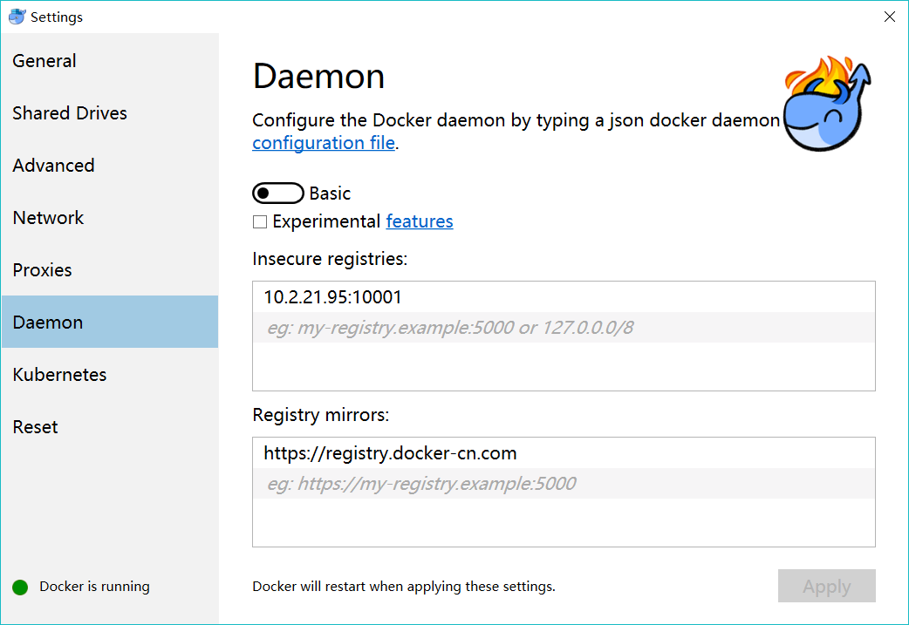

## docker 配置

##### windows10



##### linux
```bash
sudo vim /etc/docker/daemon.json
{
  "registry-mirrors": [
    "https://registry.docker-cn.com"
  ],
  "insecure-registries": [
    "10.2.21.95:10001"
  ]
}
:wq
systemctl restart docker

```


## docker 构建jre镜像


```
    # 宿主镜像 https://hub.docker.com/search?q=alpine-glibc&type=image
    # 私有镜像仓库 http://ubuntu:8081/#browse/search/docker
    tar zxf jre-8u211-linux-x64.tar.gz
    cd jre1.8.0_211
    rm -rf COPYRIGHT LICENSE README release THIRDPARTYLICENSEREADME-JAVAFX.txt THIRDPARTYLICENSEREADME.txt Welcome.html
    rm -rf   lib/plugin.jar \
             lib/ext/jfxrt.jar \
             bin/javaws \
             lib/javaws.jar \
             lib/desktop \
             plugin \
             lib/deploy* \
             lib/*javafx* \
             lib/*jfx* \
             lib/amd64/libdecora_sse.so \
             lib/amd64/libprism_*.so \
             lib/amd64/libfxplugins.so \
             lib/amd64/libglass.so \
             lib/amd64/libgstreamer-lite.so \
             lib/amd64/libjavafx*.so \
             lib/amd64/libjfx*.so

    tar zcvf jre8.tar.gz *
    mv jre8.tar.gz  ../
    
    vim Dockerfile
    # using alpine-glibc instead of alpine  is mainly because JDK relies on glibc
    FROM docker.io/jeanblanchard/alpine-glibc
    # author
    MAINTAINER yangguang02@zjft.com
    # A streamlined jre
    ADD jre8.tar.gz /usr/java/jdk/
    # set env
    ENV JAVA_HOME /usr/java/jdk
    ENV PATH ${PATH}:${JAVA_HOME}/bin
    ENV CLASSPATH ${CLASSPATH}:${JAVA_HOME}/lib/rt.jar:${JAVA_HOME}/lib/dt.jar:${JAVA_HOME}/lib/tools.jar
    # run container with base path:/opt
    WORKDIR /opt
    :wq
    
    sudo docker build -t 10.2.21.95:10001/zj-jre:1.8.0_211 .
    sudo docker images
    sudo docker run -it 10.2.21.95:10001/zj-jre:1.8.0_211
    docker push 10.2.21.95:10001/zj-jre:1.8.0_211 

```
## 安装有中文字体的Dockerfile
```bash
    # using alpine-glibc instead of alpine  is mainly because JDK relies on glibc
    FROM docker.io/jeanblanchard/alpine-glibc
    # author
    MAINTAINER yangguang02@zjft.com
    # A streamlined jre
    ADD jre8.tar.gz /usr/java/jdk/
    ADD msyhbd.ttc  /opt/
    ADD msyhl.ttc   /opt/
    ADD msyh.ttc    /opt/
    ADD simhei.ttf  /opt/
    ADD simkai.ttf  /opt/
    ADD simsun.ttc  /opt/
    # set env
    ENV JAVA_HOME /usr/java/jdk
    ENV PATH ${PATH}:${JAVA_HOME}/bin
    ENV CLASSPATH ${CLASSPATH}:${JAVA_HOME}/lib/rt.jar:${JAVA_HOME}/lib/dt.jar:${JAVA_HOME}/lib/tools.jar
    # run container with base path:/opt
    WORKDIR /opt
    # install font
    RUN apk add font-adobe-100dpi \
        && chmod 777 *.ttc \
        && chmod 777 *.ttf \
        && mkdir /usr/share/fonts/win \
        && mv msyhbd.ttc /usr/share/fonts/win/  \
        && mv msyhl.ttc  /usr/share/fonts/win/  \
        && mv msyh.ttc   /usr/share/fonts/win/  \
        && mv simhei.ttf /usr/share/fonts/win/  \
        && mv simkai.ttf /usr/share/fonts/win/  \
        && mv simsun.ttc /usr/share/fonts/win/  \
        && fc-cache -f \
        && fc-list

```


## docker 打包 上传


``` 
    docker login -u publisher 10.2.21.95:10001
    docker build -t ygsama/treasury-brain:1.1.0-SNAPSHOT .
    docker tag  ygsama/docker-test:latest 10.2.21.95:10001/treasury-brain:1.1.0-SNAPSHOT
    docker push 10.2.21.95:10001/treasury-brain:1.1.0-SNAPSHOT
 
```

## docker 运行

```

    docker run -p 9090:8080 10.2.21.95:10001/treasury-brain:1.1.0-SNAPSHOT

```
## docker 进入容器

```bash

    docker exec -it containerid bash

```