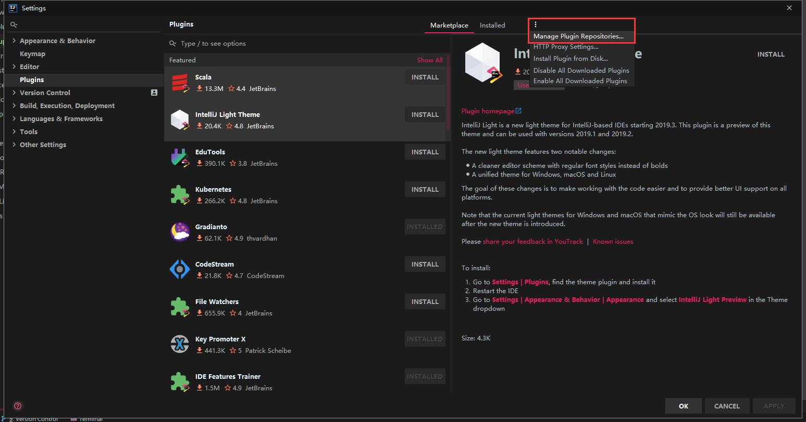
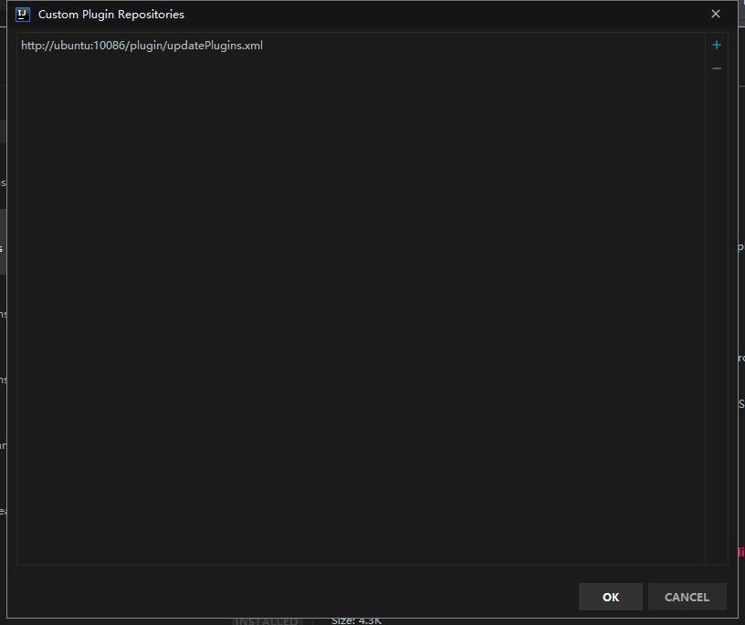
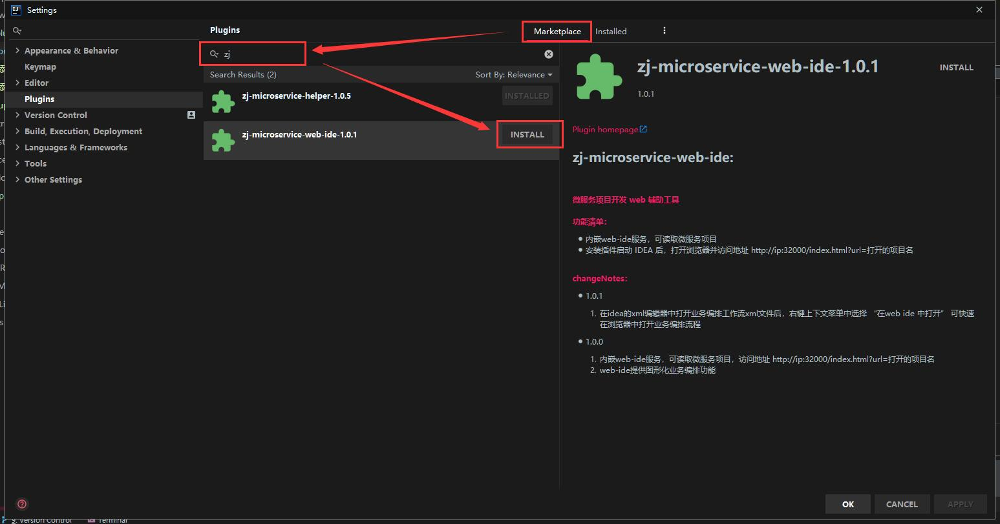

## zj-microservice-web-ide 插件安装指引

**请使用 idea 2018.3 及以上版本**

1.打开 idea 的 Settings -> Plugins

2.添加仓库地址：`http://ubuntu:10086/plugin/updatePlugins.xml` 

3.搜索并安装插件 `zj-microservice-web-ide`

4.安装好后请重启 IDEA

5.插件使用请参考[使用教程](./user-guides.md)