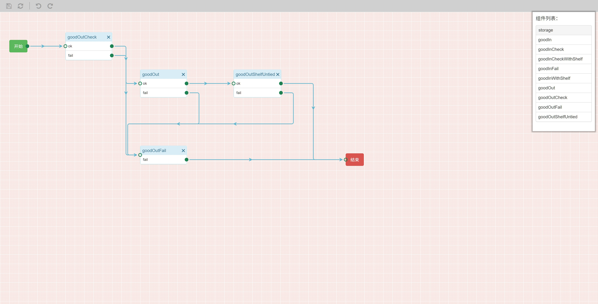

## 流程编辑器

工作流编辑器，工具栏，画布和组件列表栏组成

组件列表只显示当前模块中可以使用的组件，并且按照分组进行了排列

#### 新增组件

要向画布中新增组件，鼠标左键按住组件列表中的组件，然后拖入到画布中即可

#### 删除组件

点击组件右上角的 X 即可删除组件

#### 新增连线

组件的出口需要连接到另一个组件，在出口的圆点处，按住鼠标左键，并拖动到下个组件的入口处，即可完成连线

#### 删除连线

在要删除连线的任意一端鼠标左键按住，然后拖到画布上空白的位置，松开左键即可删除连线