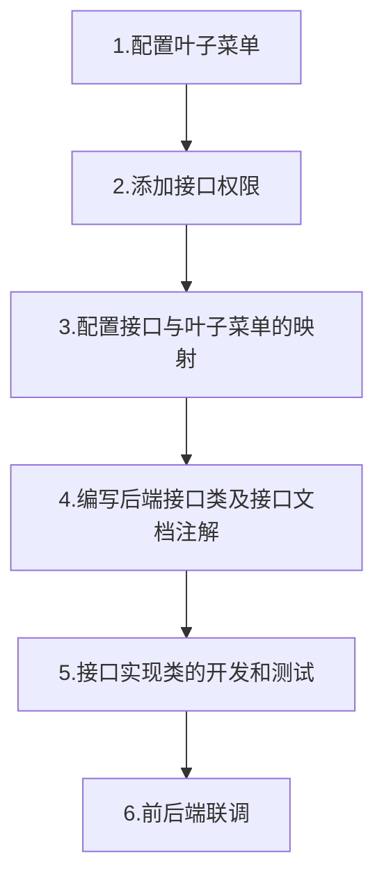

# 接口与菜单权限的开发配置规范

前置规范：[项目开发规范](../developer-guides/README.md)

本规范适用于以下项目:
- 微服务聚合工程
- zj-auth-admin 基础权限管理模块

## 0. 接口配置及开发流程



## 1. 添加菜单权限配置
菜单表：sys_menu (参考建表语句或数据库)
1. 配置父菜单
    > 配置开发接口所属的菜单模块, 不同的模块有不同的前缀，如:  ( 系统管理='A'、加钞模块='B' )
2. 配置菜单ID
    > 配置有序的ID (父菜单是A01，子菜单应为A0101、A0102)
3. 配置菜单类型
    1. button_tag=0, 父菜单
    1. button_tag=1, 叶子菜单（最小功能单元，根据具体业务需求调整粒度）
    3. button_tag=3, 叶子菜单，隐藏型（不会显示在顶部菜单栏）

4. 配置接口类型
    1. catalog=1, 系统开放的接口
    1. catalog=2, 用户需要权限的接口
    3. catalog=3, 用户公共访问的接口

`SYS_PERMISSION` 添加接口
<!DOCTYPE html>
<html>
<head>
  <title></title>
</head>
<body>
<table border="1" style="border-collapse:collapse">
<tr><th>NO</th><th>NAME</th><th>URL</th><th>METHOD</th><th>CATALOG</th><th>NOTE</th></tr>
<tr><td>2001</td><td>用户添加</td><td>/user-center/v2/user</td><td>POST</td><td>2</td><td>用户中心—用户管理</td></tr>
<tr><td>2002</td><td>用户修改</td><td>/user-center/v2/user</td><td>PUT</td><td>2</td><td>用户中心—用户管理</td></tr>
<tr><td>2003</td><td>用户删除</td><td>/user-center/v2/user/*</td><td>DELETE</td><td>2</td><td>用户中心—用户管理</td></tr>
<tr><td>2004</td><td>用户分页查询</td><td>/user-center/v2/user</td><td>GET</td><td>2</td><td>用户中心—用户管理</td></tr>
<tr><td>2005</td><td>用户详情查询</td><td>/user-center/v2/user/detail</td><td>GET</td><td>2</td><td>用户中心—用户管理</td></tr></table>
</body>
</html>


`SYS_MENU` 添加菜单


<!DOCTYPE html>
<html>
<head>
  <title></title>
</head>
<body>
<table border="1" style="border-collapse:collapse">
<tr><th>NO</th><th>NAME</th><th>MENU_FATHER</th><th>URL</th><th>BUTTON_TAG</th></tr>
<tr><td>0</td><td>现金实物运营管理系统</td><td>NULL</td><td>NULL</td><td>0</td></tr>
<tr><td>A</td><td>系统管理</td><td>0</td><td>NULL</td><td>0</td></tr>
<tr><td>A00</td><td>用户管理</td><td>A</td><td>NULL</td><td>0</td></tr>
<tr><td>A0003</td><td>用户管理</td><td>A00</td><td>/system/user</td><td>0</td></tr>
<tr><td>A000301</td><td>用户添加</td><td>A0003</td><td>NULL</td><td>1</td></tr>
<tr><td>A000302</td><td>用户修改</td><td>A0003</td><td>NULL</td><td>1</td></tr>
<tr><td>A000303</td><td>用户删除</td><td>A0003</td><td>NULL</td><td>1</td></tr>
<tr><td>A000304</td><td>用户查询</td><td>A0003</td><td>NULL</td><td>1</td></tr></table>
</body>
</html>

`SYS_MENU_PERMISSION` 中添加叶子菜单到接口的映射

<!DOCTYPE html>
<html>
<head>
  <title></title>
</head>
<body>
<table border="1" style="border-collapse:collapse">
<tr><th>MENU_NO</th><th>PERMISSION_NO</th></tr>
<tr><td>A000301</td><td>2001</td></tr>
<tr><td>A000302</td><td>2002</td></tr>
<tr><td>A000303</td><td>2003</td></tr>
<tr><td>A000304</td><td>2004</td></tr>
<tr><td>A000304</td><td>2005</td></tr></table>
</body>
</html>

`SYS_ROLE_MENU` 添加角色到叶子菜单的映射
<!DOCTYPE html>
<html>
<head>
  <title></title>
</head>
<body>
<table border="1" style="border-collapse:collapse">
<tr><th>ROLE_NO</th><th>MENU_NO</th></tr>
<tr><td>10001</td><td>A000301</td></tr>
<tr><td>10001</td><td>A000302</td></tr>
<tr><td>10001</td><td>A000303</td></tr>
<tr><td>10001</td><td>A000304</td></tr></table>
</body>
</html>

## 2. 配置接口权限及类型
菜单表：sys_permission (具体字段参考建表语句或数据库)
1. 配置接口信息，接口的URL需要遵循RESTful风格
    
    >GET     用来获取资源，GET http://api.xxx.com/user-center/v1/user/{id}           查询用户信息<br/>
     POST    用来新建资源. 比如：POST http://api.xxx.com/user-center/v1/user          添加用户 <br/>
     PUT     更新资源. 幂等操作， 比如：PUT http://api.xxx.com/user-center/v1/user     更新用户 <br/>
     DELETE  用来删除资源. 比如：DELETE http://api.xxx.com/user-center/v1/user/{id}   删除用户  <br/>
     
    >正确的使用方式： DELETE http://api.xxx.com/user-center/v1/user/userid123  删除用户 <br/>
     错误的使用方式： GET    http://api.xxx.com/user-center/v1/deleteUser      删除用户 <br/>
     
    >配置示例：sys_permission(id='1021', name='用户添加', url='/user-center/v2/user', method='POST', 备注='用户管理模块')
    
2. url 规范
    1. url前缀由`/{主模块名}/{版本号}/{子模块名}/...`组成
    2. 合理使用通配符 `*` , 如: 根据ID查询角色详情 `/auth/v2/role/*`
    3. 避免使用 `**` , 如: `/auth/v2/**` 匹配所有模块
    4. 不支持使用`/a**`匹配`/abc`、`/a/b/c`

3. method 请求方法规范
    1. 支持所有的请求方法，但是必须大写
    2. `GET` 查询操作
    3. `POST` 添加、提交等操作
    4. `PUT` 修改操作，要求幂等，即相同的PUT请求，其产生的影响一定相同
    4. `DELETE` 删除操作
    5. 禁止在需要控制权限的接口上使用通配符 `*`

4. 接口类型
    1. catalog=1, 系统接口
    1. catalog=2, 权限接口
    1. catalog=3, 公共接口
    <!DOCTYPE html>
    <html>
    <head>
      <title></title>
    </head>
    <body>
    <table border="1" style="border-collapse:collapse">
    <tr><th>NO</th><th>NAME</th><th>URL</th><th>METHOD</th><th>CATALOG</th><th>NOTE</th></tr>
    <tr><td>1001</td><td>前端OPTIONS</td><td>/**</td><td>OPTIONS</td><td>1</td><td>NULL</td></tr>
    <tr><td>2001</td><td>用户添加</td><td>/auth/v2/user</td><td>POST</td><td>2</td><td>权限模块—用户管理</td></tr>
    <tr><td>2002</td><td>用户修改</td><td>/auth/v2/user</td><td>PUT</td><td>2</td><td>权限模块—用户管理</td></tr>
    <tr><td>2003</td><td>用户删除</td><td>/auth/v2/user/*</td><td>DELETE</td><td>2</td><td>权限模块—用户管理</td></tr>
    <tr><td>2004</td><td>用户分页查询</td><td>/auth/v2/user</td><td>GET</td><td>2</td><td>权限模块—用户管理</td></tr>
    <tr><td>2005</td><td>用户详情查询</td><td>/auth/v2/user/detail</td><td>GET</td><td>2</td><td>权限模块—用户管理</td></tr>
    <tr><td>3001</td><td>登陆</td><td>/sys/callback/login</td><td>POST</td><td>3</td><td>公共接口</td></tr>
    <tr><td>3002</td><td>刷新token</td><td>/sys/callback/refresh</td><td>POST</td><td>3</td><td>公共接口</td></tr>
    <tr><td>3005</td><td>swagger</td><td>/swagger-ui.html</td><td>*</td><td>3</td><td>公共接口—接口文档</td></tr>
    <tr><td>3006</td><td>swagger</td><td>/swagger-ui.html/**</td><td>*</td><td>3</td><td>公共接口—接口文档</td></tr>
    <tr><td>3007</td><td>swagger</td><td>/v2/**</td><td>*</td><td>3</td><td>公共接口—接口文档</td></tr>
    <tr><td>3008</td><td>swagger</td><td>/webjars/**</td><td>*</td><td>3</td><td>公共接口—接口文档</td></tr></table>
    </body>
    </html>

## 3. 编写接口类及接口文档注解
1. 使用swagger 配置接口文档, 详见 [swagger 使用说明](../specifications/接口文档开发规范.md)
1. 接口类命名以Resource结尾，如SysRoleResource
2. 禁止使用`@RequestMapping`注解，需要明确使用请求方法注解`@GetMapping`, `@PostMapping`, `@PutMapping`, `@DeleteMapping`等等
3. 已上线的版本不允许修改方法签名，避免对接口调用方产生影响。接口过时必须加`@Deprecated`注解，并清晰地说明采用的新接口或者新服务是什么。

## 4. 接口实现类的开发和测试
细节请参考[《阿里巴巴java开发规范》](https://www.baidu.com/s?wd=%E9%98%BF%E9%87%8C%E5%B7%B4%E5%B7%B4java%E5%BC%80%E5%8F%91%E8%A7%84%E8%8C%83)

1. 【强制】不能使用过时的类或方法。
   说明： java . net . URLDecoder 中的方法 decode(String encodeStr) 这个方法已经过时，应
   该使用双参数 decode(String source, String encode) 。接口提供方既然明确是过时接口，
   那么有义务同时提供新的接口 ； 作为调用方来说，有义务去考证过时方法的新实现是什么。

2. 【强制】泛型通配符<?  extends T >来接收返回的数据，此写法的泛型集合不能使用 add 方
  法，而 <? super T> 不能使用 get 方法，做为接口调用赋值时易出错。
  说明：扩展说一下 PECS(Producer Extends Consumer Super) 原则：第一、频繁往外读取内
  容的，适合用<?  extends T >。第二、经常往里插入的，适合用 <? super T> 。
  
3. 【推荐】不要写一个大而全的数据更新接口。传入为 POJO 类，不管是不是自己的目标更新字
   段，都进行 update table set c1=value1,c2=value2,c3=value3;  这是不对的。执行 SQL
   时，不要更新无改动的字段，一是易出错 ； 二是效率低 ； 三是增加 binlog 存储。
   
4. 【参考】@ Transactional 事务不要滥用。事务会影响数据库的 QPS ，另外使用事务的地方需
      要考虑各方面的回滚方案，包括缓存回滚、搜索引擎回滚、消息补偿、统计修正等。

5. 【强制】二方库里可以定义枚举类型，参数可以使用枚举类型，但是接口返回值不允许使用枚
   举类型或者包含枚举类型的 POJO 对象。
   
6. 【强制】对 trace / debug / info 级别的日志输出，必须使用条件输出形式或者使用占位符的方式。
   说明： 
   
   ```java
       logger . debug( " Processing trade with id : " +  id + "  and symbol : " +  symbol);
   ```
   如果日志级别是 warn ，上述日志不会打印，但是会执行字符串拼接操作，如果 symbol 是对象，
   会执行 toString() 方法，浪费了系统资源，执行了上述操作，最终日志却没有打印。
   
   正例： （ 条件 ）
   ```java
       if (logger.isDebugEnabled()) {
       logger.debug("Processing trade with id: " + id + " and symbol: " + symbol);
       }
    ```
   正例： （ 占位符 ）
   ```java
       logger.debug("Processing trade with id: {} and symbol : {} ", id, symbol);
    ```
   
   
## 5. 前后端联调
前后端通过接口文档联调，并测试


