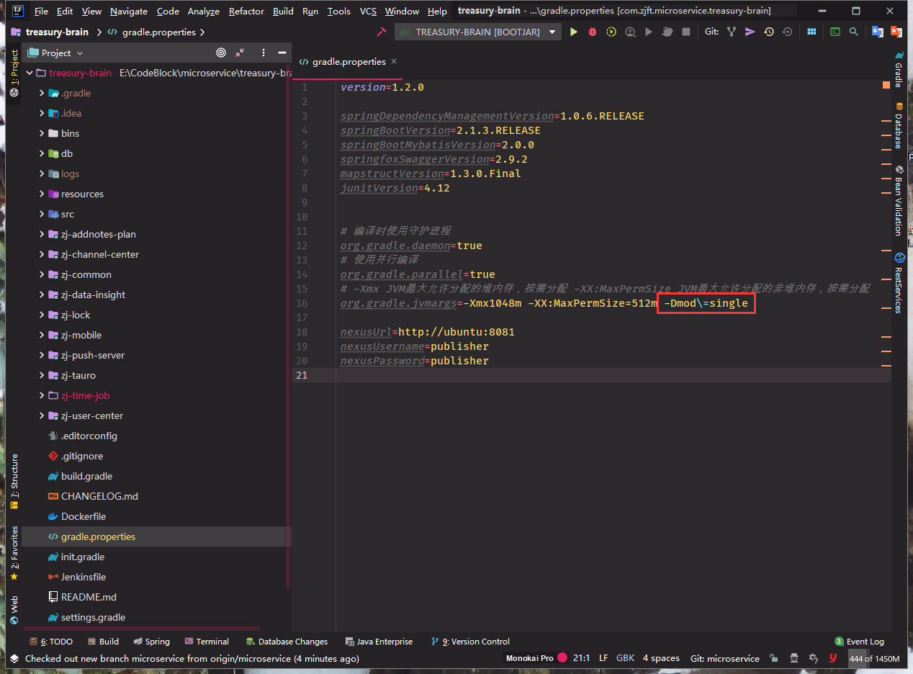

#### 环境准备
- 启动Nacos, 并修改`bootstrap.yml`配置文件中的地址
    
    ```yml
    # 样例
    spring:
      application:
        name: api-gateway
      cloud:
        nacos:
          discovery:
            server-addr: 10.34.12.130:8848
          config:
            server-addr: 10.34.12.130:8848
            file-extension: yml
    ```
- 启动SkyWalking, 每个服务需要增加参数
    
    `-DSW_AGENT_NAME`是指定服务名称，也可以配置在agent探针内
    `-javaagent`是指定服务的agent探针
    例如：`-DSW_AGENT_NAME=加钞服务 -javaagent:E:\apache-skywalking-apm-bin\agent\skywalking-agent.jar`


#### 编译配置
添加 Gradle JVM 编译配置：
    
    -Dmod\=single




单体应用模式启动类：
 
    配置：-Dmod\=single 并刷新 gradle 依赖
    
    根目录 -> src -> 找到 XxxApplication#main() 启动

微服务模式启动类：
    
    配置：-Dmod\=cloud 并刷新 gradle 依赖
    
    启动各个服务中的 Application#main()
    
**注意检查：**

    IDEA 2019 版本开始，启动配置中默认勾选了 `include dependencies with 'Provided' scope` 需要去除勾选

#### 基于 gradle 参数化构建

- 使用 `gradle build -Dmod=cloud` 来构建微服务模式的应用
- 使用 `gradle build -Dmod=single` 来构建单体模式的应用

#### 接口文档：手动填写token认证方式
1. 每个服务需要写一个独立的`main()启动类`用来启动
1. 项目启动后访问网关：`http://IP:port/swagger-ui.html`
1. 在页面右上角选择不同的服务
1. 使用用户登录接口获取token后，添加到右上角`Authorize`按钮中
    
    ```
    Bearer your_access_token
    ```

#### 提供给其他服务调用的client子模块
    
    client子模块需要继承api接口，作为 @FeignClient 由 Feign 框架来生成具体实现类
    我们只需要编写 interface 并使用 @FeignClient 注解标注即可


