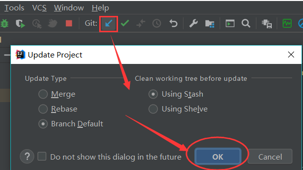
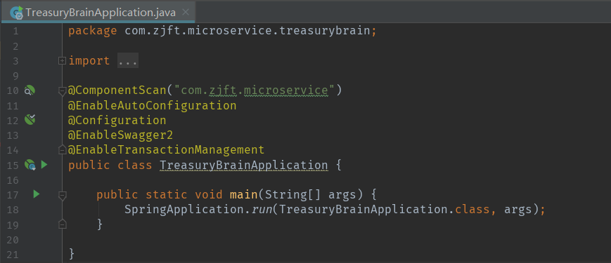
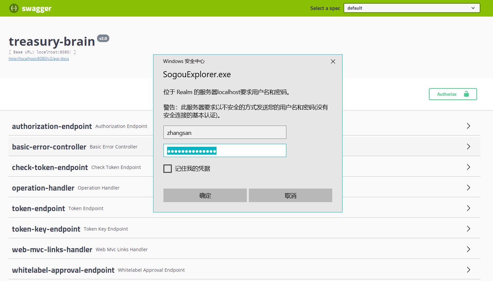

## 快速开始

### 1.基础环境准备

1. jdk：1.8_202 正确配置环境变量
2. Maven 环境
3. Gradle 版本 4.8 及以上（gradle 5 目前尚未很好支持，切勿使用），并按照如下方式 [配置gradle构建工具](http://ubuntu/zj-public/gitlab-user-doc/blob/master/Gradle/Gradle-Config.md)
3. IDEA 版本 2019.1 及以上
4. IDEA [配置 zj-microservice-web-ide 插件](../idea-plugin/setup.md)
5. IDEA [配置 lombok 插件](http://ubuntu/zj-public/gitlab-user-doc/blob/master/Idea/Lombok-Plugin.md)
6. 请阅读 [gitlab 分支使用规范](http://ubuntu/zj-public/gitlab-user-doc/blob/master/Gitlab/Use-Branch.md)

### 2.快速开始

#### 2.1.检出项目

```bash
git clone project-git-repo
```

使用IDEA打开并选择 Gradle 导入

#### 2.2.切换分支
IDEA右下角 -> 单击`Git:XXX` -> 
    
    `Remote Brances`下可切换到远程其他分支；
    `Local Brances`下可切换到本地其他分支

#### 2.3.更新项目版本

获取最新版本信息：
    
    IDEA顶部菜单栏 -> VCS -> Git -> Fetch

更新到最新版本：

    IDEA顶部菜单栏 -> VCS -> Update Project
    


#### 2.4启动应用

找到src目录下的`TreasuryBrainApplication`，运行`main()`方法，即可启动应用


    
**注意检查：**

    IDEA 2019 版本开始，启动配置中默认勾选了 `include dependencies with 'Provided' scope` 需要去除勾选

#### 2.5.测试接口文档

1. 项目启动后访问：`http://IP:port/swagger-ui.html`
1. 登录账号密码`zhangsan/123456`



#### 2.6.打包

```cmd
gradle bootJar
```
构建产出在 build/libs 中

#### 2.7.发布

目前通过jenkins/blue-ocean，可以自动化的编译打包发布最新的代码
